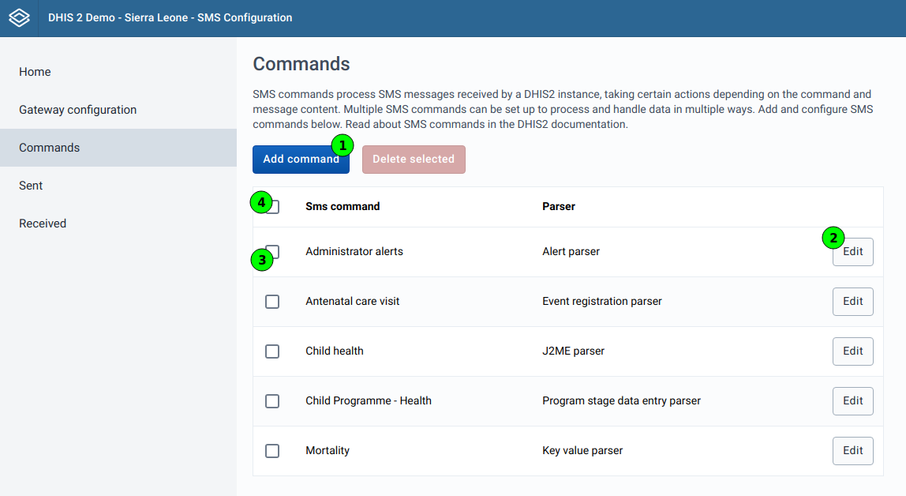
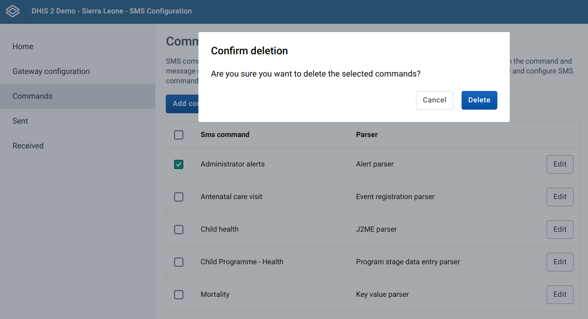
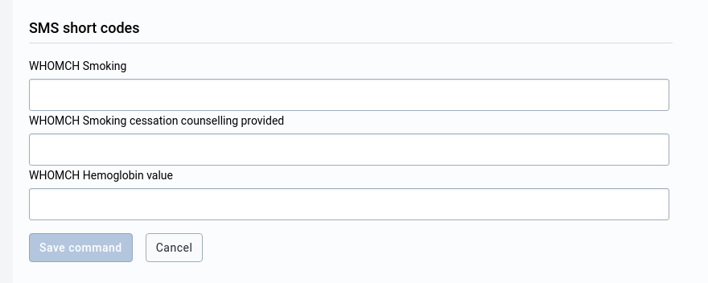
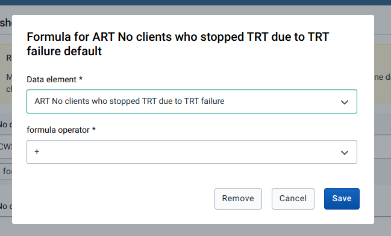
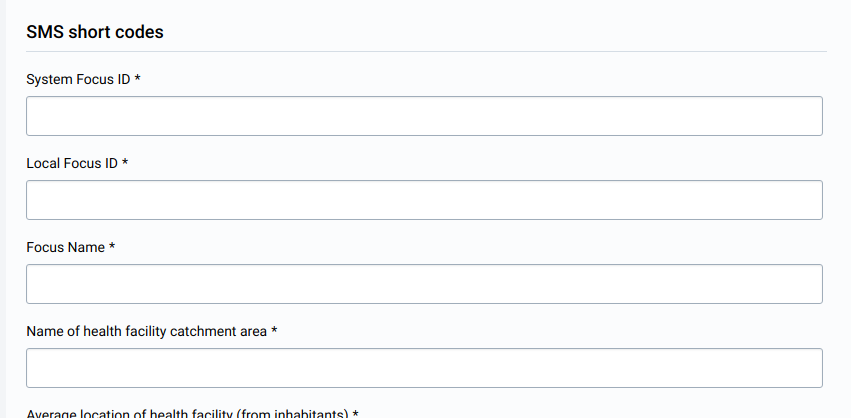
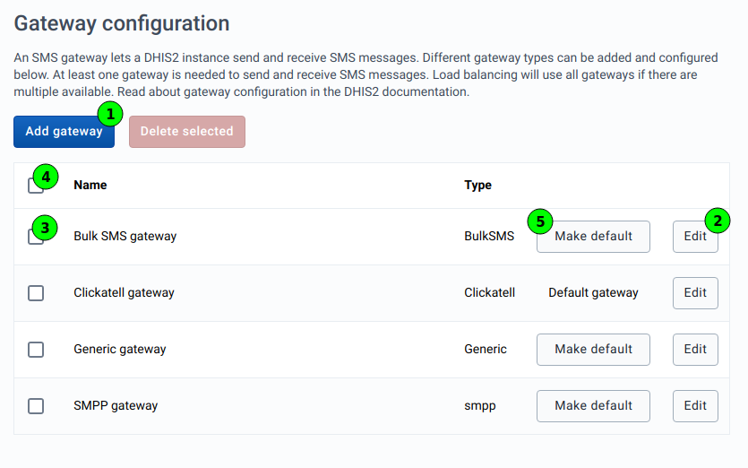
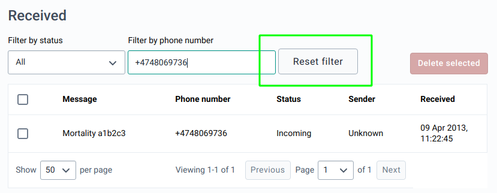
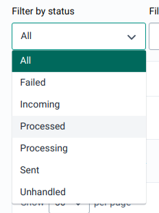
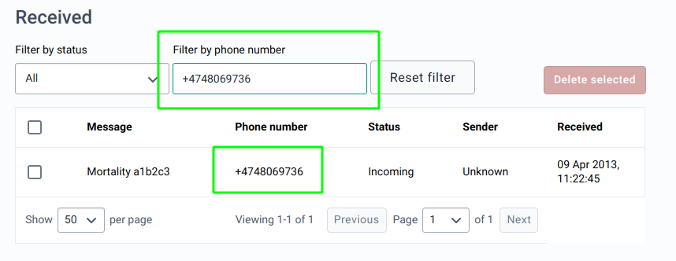

# Configuring SMS
<!--DHIS2-SECTION-ID:sms-configuration-intro-->

## SMS Commands
<!--DHIS2-SECTION-ID:sms-configuration-commands-->

SMS commands process SMS messages received by a DHIS2 instance, taking certain
actions depending on the command and message content. Multiple SMS commands can
be set up to process and handle data in multiple ways. A SMS command is an
object containing the configurations for each SMS form: reporting data from
phones or j2me apps, alerting users, registering patient or user, etc.

### Listing available commands
<!--DHIS2-SECTION-ID:sms-configuration-commands-list-->

To see all available commands, navigate to the "Commands" page.
All commands will be listed in a paginated table. On this page the following
actions are available:

* Add commands (1)
* Edit commands (2)
* Delete commands (3)
* Batch-delete commands (4)

### Delete available commands
<!--DHIS2-SECTION-ID:sms-configuration-commands-delete-->

Deleting commands can be done by individually checking the checkboxes of each
command (1) that should be deleted or by selecting all displayed commands by
checking the checkbox in the table head (2). After selecting the commands to
delete, the "Delete selected" button needs to be clicked (3).

To prevent accidental deletions, a confirmation dialog will show up.

### Adding commands
<!--DHIS2-SECTION-ID:sms-configuration-commands-add-->

&#9888; &#9888; &#9888; **WARNING!** &#9888; &#9888; &#9888; 
Commands are not working after they've been added!
Most of the configurable fields are only displayed when editing the command!

After clicking on the "Add command" button in the command overview page, a
dynamic form will appear. Depending on the parser type, different inputs will
be displayed:

| Parser type | User group | Program | Program Stage | Data set |
|-|-|-|-|-|
| Alert parter | &#10003; | &#10005; | &#10005; | &#10005; |
| Event registration parser | &#10005; | &#10003; | &#10003; | &#10005; |
| J2ME parser | &#10005; | &#10005; | &#10005; | &#10003; |
| Key value parser | &#10005; | &#10005; | &#10005; | &#10003; |
| Program stage data entry parser | &#10005; | &#10003; | &#10003; | &#10005; |
| Tracked entity registration parser | &#10005; | &#10003; | &#10005; | &#10005; |
| Unregistered parser | &#10003; | &#10005; | &#10005; | &#10005; |

#### Event registration parser
<!--DHIS2-SECTION-ID:sms-configuration-commands-add-eventregistration-->

These commands can have short codes for their associated program stage.
Only programs of type "Event program" can be chosen for this command.
Therefore only one program stage exists, which will be selected automatically.

#### Program stage data entry parser
<!--DHIS2-SECTION-ID:sms-configuration-commands-add-programstagedataentry-->

These commands can have short codes for their associated program stage.
Only programs of type "Tracker program" can be chosen for this command.
Unlike "Event registration" parsers, a program stage has to be chosen for this
parser type.

### Editing commands
<!--DHIS2-SECTION-ID:sms-configuration-commands-edit-->

When editing commands, changing the parser type as well as the additional data
supplied when adding the command is not possible. The only way this is
currently possible is by creating a new command and deleting the old one.

There are certain parameters which are common to all SMS Command types.
These parameters have default values configured in the system, if user
does provide any value to these parameters then those default ones will
be used. Here is the list of those parameters

These common fields are:

| Parameter | Type | Description |
|---|---|---|
| Field Separator | String | To provide custom field separator. Default is "&#124;" |
| Reply message if no codes are sent (only the command) | String | To provide message if no code is found in SMS text input. Default is "Parameter missing" |
| Wrong format message | String | To provide message if command is not formatted correctly. Command should be formatted as per code value separator. This message will also be sent back if any mandatory parameter is missing. |
| No user message | String | To provide message if sending phone number is not registered in DHIS2. |
| User belong to more than one OrgUnit message | String | Certain SMS command types require user ( retrieved from sending phone number ) to be associated with only one organization unit. This message can be configured to be sent back in case that requirement is not fullfilled. |
| Success Message | String | To provide message that will be sent upon successful completion of the process. |

Some commands have the option to add short codes, which are explained in the
individual sections for each parser type down below.

#### Editing alert parser commands
<!--DHIS2-SECTION-ID:sms-configuration-commands-edit-alertparser-->

When editing an alert parser command, only two fields are editable, the fields
that are shared between most parser types are not present:

* Name (required)
* Confirm message

Both are text fields.

#### Editing event registration parser commands
<!--DHIS2-SECTION-ID:sms-configuration-commands-edit-eventregistration-->

Commands of this parser type have all the shared fields.
Additionally short codes can be defined.
A short code can be added for every data element connected to the program stage
that was selected when adding the command:

#### Editing J2ME parser commands
<!--DHIS2-SECTION-ID:sms-configuration-commands-edit-j2me-->

Commands of this parser type have all the shared fields. The SMS command will
have a dataset because those are used for reporting data. If data is reported
for a Period which is already approved then SMS response will be sent back
containing information about approval status of the period. Additionally short
codes can be defined. Each command is connected to a dataset. The dataset has
data elements, which have category combos, which have at least one category
option combo. For every existing "data element - category option combo"
combination, a short code can be provided.

Required values notice Make sure at least one SMS short code is provided when
completeness method "Receive at least one data value" is chosen, otherwise
received messages will not be processed.

##### Short code fomulas
<!--DHIS2-SECTION-ID:sms-configuration-commands-edit-j2me-shortcodeformulas-->

Each short code can have an optional formula. By providing a formula, the value
of a different data element can be either added or subtracted.

This can be done by clicking the "Add formula" / "Edit formula" button below
the short code's input field:

When clicking the button, a modal will appear which offers a dropdown to select
a data element, and the formula operator, which can be either "+" or "-":

By clicking "Save", the formula will be added to the main edit form, it does
not get saved to the command automatically! In order to save a changed formula,
you need to submit the whole form.

###### Removing a short code formula
<!--DHIS2-SECTION-ID:sms-configuration-commands-edit-j2me-removingshortcodeformula-->

If a short code has a formula, it can be removed by clicking the "Edit formula"
button. The modal that will appear, has a button "Remove". By clicking that
button, the formula will be removed from the short code in the main form and
the modal will close. It does not get saved to the command automatically! In
order to save the removal of the formula, you need to submit the whole form.

#### Editing key value parser commands
<!--DHIS2-SECTION-ID:sms-configuration-commands-edit-keyvalue-->

This command type works identically to J2ME parser commands work. Please check
the documentation above.

#### Editing program stage data entry parser commands
<!--DHIS2-SECTION-ID:sms-configuration-commands-edit-programstagedataentry-->

Commands of this parser type have all the shared fields.  Additionally short
codes can be defined. A short code can be added for every data element
connected to the program stage that was selected when adding the command:

#### Editing tracked entity registration parser commands
<!--DHIS2-SECTION-ID:sms-configuration-commands-edit-trackedentityregistration-->

Commands of this parser type have all the shared fields.  Additionally short
codes can be defined. A short code can be added for every tracked entity
attribute connected to the program that was selected when adding the command:

#### Editing unregistered parser commands
<!--DHIS2-SECTION-ID:sms-configuration-commands-edit-unregistered-->

This command type works identically to alert parser commands work. Please check
the documentation above.

## SMS Gateways
<!--DHIS2-SECTION-ID:sms-configuration-gateways-->

An SMS gateway lets a DHIS2 instance send and receive SMS messages. Different
gateway types can be added and configured below. At least one gateway is needed
to send and receive SMS messages. Load balancing will use all gateways if there
are multiple available.

There are four types of Gateways supported by the SMS Service:
* Generic gateways
* BulkSMS gateways
* Clickatell gateways
* SMPP gateways

### Listing gateways
<!--DHIS2-SECTION-ID:sms-configuration-gateways-listing-->

To see all available gateways, navigate to the "Gateway configurations" page.
All gateways will be listed in a table. On this page the following actions are
available:

* Add gateways (1)
* Edit gateways (2)
* Delete gateways (3)
* Batch-delete gateways (4)
* Set the default gateway (5)

### Adding gateways
<!--DHIS2-SECTION-ID:sms-configuration-gateways-add-->

After clicking on the "Add gateway" button in the gateway configurations
overview page, a dynamic form will appear. It's devided into two sections:

1. The gateway type (1)
1. The gateway's configuration, depends on the gateway type (2)

For more details about configuring gateways, please refer to the [Gateway
Configurations](#gateway.configuration) section of the "Mobile" maintenance
documentation.

### Editing gateways
<!--DHIS2-SECTION-ID:sms-configuration-gateways-edit-->

Editing is similar to adding gateways with the exception that the gateway type
cannot be altered. If a gateway has the wrong type, it needs to be deleted and
added again. For more information how to edit gateways, please refer to the
"Adding gateways" section above.

## View inbound SMS
<!--DHIS2-SECTION-ID:sms-configuration-inbound-->

To see all inbound sms, navigate to the "Received" page.  All received sms will
be listed in a paginated table. On this page the following actions are
available:

* Filtering the inbound SMSes (1)
* Deleting SMSes (2)
* Batch-deleting SMSes (3)

### Filtering 
<!--DHIS2-SECTION-ID:sms-configuration-inbound-filtering-->

#### Resetting filters
<!--DHIS2-SECTION-ID:sms-configuration-inbound-filtering-resetting-->

All set filters can be reset by clicking on the "Reset filter" button.

#### Filtering by status
<!--DHIS2-SECTION-ID:sms-configuration-inbound-filtering-status-->

The list of inbound SMSes can be filtered by the following statuses:

* All
* Failed
* Incoming
* Processed
* Processing
* Sent
* Unhandled

#### Filtering by phone number
<!--DHIS2-SECTION-ID:sms-configuration-inbound-filtering-phonenumber-->

By entering a phone number in the input field above the table with the SMSes,
the table can be filtered by that phone number.

## View outbound SMS
<!--DHIS2-SECTION-ID:sms-configuration-outbound-->

This section is identical to the "Inbound"/"Received" SMSes section, with only
one difference: The list cannot be filtered by a phone number. Please refer to
the ["View inbound SMS"](#sms-configuration-inbound) section.
